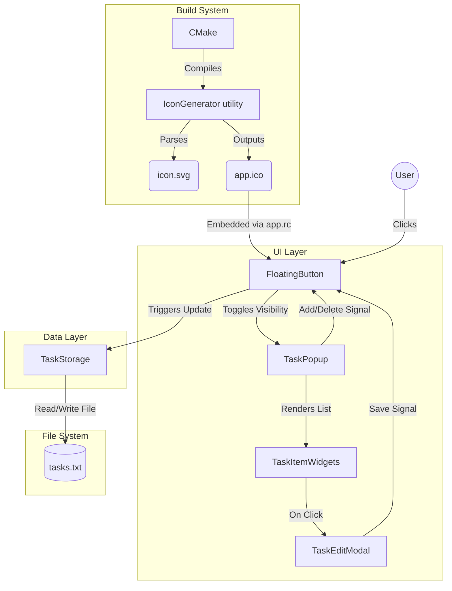

# MiniTasks

MiniTasks is an ultra-minimalistic, high-performance desktop task tracker built for Windows using C++ and Qt6. It features a transparent, glassmorphic UI, a floating task trigger, and synchronous plain-text local storage for determinism and speed.

## Core Features

- **Draggable Floating Trigger Widget:** A frameless, transparent, "always-on-top" trigger button that rests unobtrusively on the screen edge and can be dragged to any custom location, persisting across restarts via `QSettings`.
- **Custom Animated SVG Icon:** The trigger utilizes Qt's SVG rendering to natively draw a complex animated SVG "bubble" without relying on bloated web views.
- **Glassmorphic Task Popup:** A sleek, transparent dark-mode UI with no Windows click-through bugs, native drop-shadows suppressed (`Qt::NoDropShadowWindowHint`), and hidden scrollbars (`Qt::ScrollBarAlwaysOff`) for a clean aesthetic.
- **Hover-Driven Interactions:** Elegant hover logic for deleting tasks, and a grow-effect for active focus.
- **Inline Modal Editing:** Click any task to open a clean overlay modal to read and edit long-form text.
- **Zero External Dependencies:** Relies entirely on native C++ standard library structures (`std::vector`, `std::fstream`) and the core Qt6 UI framework.
- **Self-Generating Executable Icons:** An embedded `IconGenerator` automatically parses SVGs and compiles native `.ico` bundled resources during the CMake phase.

## Application Architecture Flow

The architecture is deliberately synchronous and straightforward. Data moves between the UI controllers and the plain-text file storage on disk sequentially.



## Implementation Details

- **Window Management & DWM:** The application avoids the common invisible-window click-through bugs in Windows by explicitly overriding the Qt `paintEvent` and manually filling the background instead of relying purely on `.setStyleSheet`. DWM Blur was intentionally removed from specific overlay widgets (like the SVG wrapper) to preserve crisp alpha-transparency boundaries without native Windows acrylic blurring artifacts.
- **Asset Compilation:** Because Windows shortcuts (`.lnk`) require native `.ico` references, the build process injects a custom step to compile an `IconGenerator` utility first. This utility turns the raw `icon.svg` into multi-layer bitmap `.ico` files and attaches them to the `.exe` via an `app.rc` Windows resource file before CPack builds the final installer payload.
- **Safe Storage Handling:** `TaskStorage.cpp` forces the use of fully-qualified AppData directories (via `QStandardPaths::AppDataLocation`) to avoid Windows permission rejections when attempting to execute standard file streams against the relative executable path.

## Complete Installation & Build Guide (Windows)

Follow these steps to clone, configure, and build the application from scratch on a new Windows machine.

### 1. Install Prerequisites

Before building, ensure you have the following tools installed on your system:

1. **[Git for Windows](https://gitforwindows.org/)**: To clone the repository.
2. **[Visual Studio Build Tools 2019 or later](https://visualstudio.microsoft.com/downloads/)**: Ensure you install the **"Desktop development with C++"** workload for the MSVC compiler.
3. **[CMake](https://cmake.org/download/)**: Version 3.16 or higher. Ensure CMake is added to your system `PATH`.
4. **[Qt 6](https://www.qt.io/download)**: Use the Qt Online Installer to install Qt 6 (e.g., Qt 6.6.0). 
   - *CRITICAL*: Ensure you select the **MSVC 2019 64-bit** (or MSVC 2022) component.
5. **[NSIS (Nullsoft Scriptable Install System)](https://nsis.sourceforge.io/Download)**: Required for CPack to generate the final `Setup.exe` standalone installer.

### 2. Clone the Repository

Open your terminal (Command Prompt or PowerShell) and clone the source code:

```cmd
# Clone the repository
git clone https://github.com/yourusername/minitasks.git

# Navigate into the project directory
cd minitasks
```

### 3. Build the Application

Create a dedicated build directory to keep the source tree clean, and use CMake to configure the project. 

*Note: You MUST replace `C:/Qt/6.6.0/msvc2019_64` with the actual path where you installed your Qt6 MSVC toolkit.*

```cmd
# Create and enter the build directory
mkdir build
cd build

# 1. Configure CMake targeting your specific Qt6 MSVC installation
cmake .. -DCMAKE_PREFIX_PATH="C:/Qt/6.6.0/msvc2019_64"

# 2. Compile the Release Executable (this also generates the .ico from the SVG)
cmake --build . --config Release

# 3. Generate the Standalone Setup.exe Installer
cpack -G NSIS -C Release
```

### 4. Install and Run

Once the CPack command completes successfully, it will generate a file named `MiniTasks-1.0.0-win64.exe` inside your `build` folder.

1. Double-click `MiniTasks-1.0.0-win64.exe` to run the installer.
2. Follow the NSIS installation wizard.
3. Launch "MiniTasks" from your Desktop shortcut or Start Menu!
