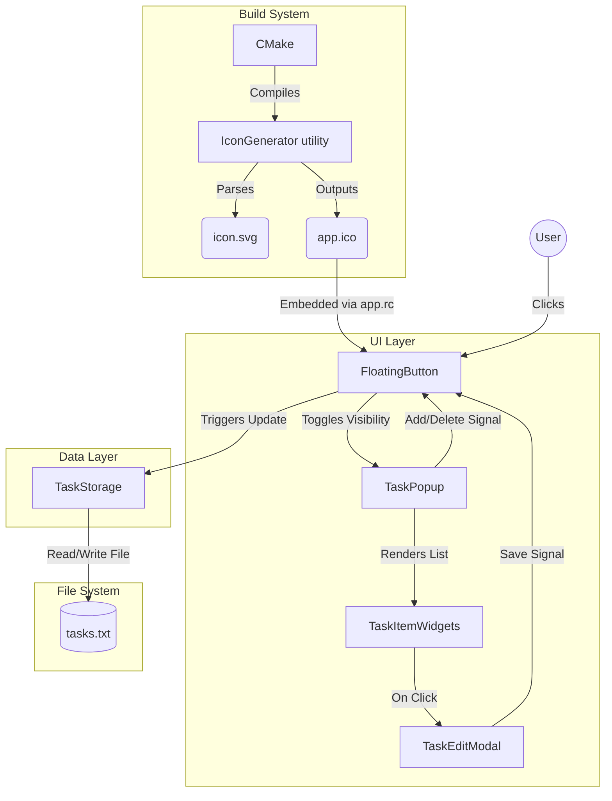

# MiniTasks

[](./Downloadable_App/MiniTasks-1.0.0-win64.exe)

MiniTasks is an ultra-minimalistic, high-performance desktop task tracker built for Windows using C++ and Qt6. It features a transparent, glassmorphic UI, a floating task trigger, and synchronous plain-text local storage for determinism and speed.

## Core Features

### UI
* **Glassmorphic Popup**
  `Dark Mode` + `No Drop Shadows` + `Hidden Scrollbars`
* **Custom SVG Trigger**
  Natively renders a complex animated SVG "bubble" without web views.
* **Inline Editing**
  Clean overlay modal for reading/editing long-form text.

### UX
* **Draggable Trigger**
  Moves anywhere on screen. Position persists across restarts via `QSettings`.
* **Hover-Driven Actions**
  Hover to reveal delete buttons; grow-effect highlights active focus.
* **Click-Through Protected**
  Custom paint events prevent Windows "invisible window" bugs.

### Architecture & Build
* **Zero Dependencies**
  Pure native C++ (`std::vector`, `std::fstream`) + core Qt6 toolkit.
* **Self-Generating Executables**
  `[icon.svg]` → `[IconGenerator]` → `[app.ico]` → `[.exe]` 

## Application Architecture Flow

The architecture is deliberately synchronous and straightforward. Data moves between the UI controllers and the plain-text file storage on disk sequentially.



## Implementation Details

### 1. Window Management & DWM
- **Problem:** Transparent windows trigger invisible "click-through" bugs in Windows.
- **Solution:** 
  - Override Qt `paintEvent`
  - Manually fill background
  - Suppress native blur (`DWM Blur`) to keep SVG alpha clean
  - Disable DWM shadows (`Qt::NoDropShadowWindowHint`)

### 2. Asset Compilation
- **Problem:** Windows shortcuts (`.lnk`) require native `.ico` files, but we only have `icon.svg`.
- **Flow:**
  `[icon.svg]` → `[IconGenerator.exe]` → `[app.ico]` → `[app.rc]` → `[MiniTasks.exe]`
- **Solution:** CMake builds an `IconGenerator` utility first, converts the SVG, and bundles it natively.

### 3. Safe Storage Handling
- **Problem:** Writing files next to `.exe` triggers Windows UAC Permission Denied errors.
- **Flow:**
  `[UI Save Request]` → `[QStandardPaths]` → `[C:\Users\...\AppData\Roaming\MiniTasks\tasks.txt]`
- **Solution:** `TaskStorage.cpp` routes all synchronous streams to the user's private AppData directory.

## Complete Installation & Build Guide (Windows)

Follow these steps to clone, configure, and build the application from scratch on a new Windows machine.

### 1. Install Prerequisites

Before building, ensure you have the following tools installed on your system:

1. **[Git for Windows](https://gitforwindows.org/)**: To clone the repository.
2. **[Visual Studio Build Tools 2019 or later](https://visualstudio.microsoft.com/downloads/)**: Ensure you install the **"Desktop development with C++"** workload for the MSVC compiler.
3. **[CMake](https://cmake.org/download/)**: Version 3.16 or higher. Ensure CMake is added to your system `PATH`.
4. **[Qt 6](https://www.qt.io/download)**: Use the Qt Online Installer to install Qt 6 (e.g., Qt 6.6.0). 
   - *CRITICAL*: Ensure you select the **MSVC 2019 64-bit** (or MSVC 2022) component.
5. **[NSIS (Nullsoft Scriptable Install System)](https://nsis.sourceforge.io/Download)**: Required for CPack to generate the final `Setup.exe` standalone installer.

### 2. Clone the Repository

Open your terminal (Command Prompt or PowerShell) and clone the source code:

```cmd
# Clone the repository
git clone https://github.com/yourusername/minitasks.git

# Navigate into the project directory
cd minitasks
```

### 3. Build the Application

Create a dedicated build directory to keep the source tree clean, and use CMake to configure the project. 

*Note: You MUST replace `C:/Qt/6.6.0/msvc2019_64` with the actual path where you installed your Qt6 MSVC toolkit.*

```cmd
# Create and enter the build directory
mkdir build
cd build

# 1. Configure CMake targeting your specific Qt6 MSVC installation
cmake .. -DCMAKE_PREFIX_PATH="C:/Qt/6.6.0/msvc2019_64"

# 2. Compile the Release Executable (this also generates the .ico from the SVG)
cmake --build . --config Release

# 3. Generate the Standalone Setup.exe Installer
cpack -G NSIS -C Release
```

### 4. Install and Run

Once the CPack command completes successfully, it will generate a file named `MiniTasks-1.0.0-win64.exe` inside your `build` folder.

1. Double-click `MiniTasks-1.0.0-win64.exe` to run the installer.
2. Follow the NSIS installation wizard.
3. Launch "MiniTasks" from your Desktop shortcut or Start Menu!


# OG_Dev_Commands
``` 
taskkill /F /IM MiniTasks.exe                      
```
```
cmake .. && cmake --build . --config Release && cpack -G NSIS -C Release
```